# 4v4 OD Sideline Camera
Orion Drift Sideline Camera v2.0 for 4v4. 

## First Time Read Me
If you're new to GitHub, then go through each of these steps.
> 1. [How To](#how-to)
> 1. [Setup](#setup)
> 1. [Run the script](#run-the-script-for-the-first-time) - if you want to have auto-clipping and/or all features
> 1. [Workflow](#base-workflow-after-setup)

If you want the auto-clipping feature:
> 1. [Auto-clipping Setup](#option-2-setup-with-auto-clipping-no-chapter-markers-or-recording-gestures)
> 1. [Run the script](#run-the-script-for-the-first-time)
> 1. [Workflow](#base-workflow-after-setup)

If you want all features (requires the most setup):
> 1. [Get all features](#option-21-obs-chapter-markers-and-triggers) - also look at [Option 2](#option-2-setup-with-auto-clipping-no-chapter-markers-or-recording-gestures) for instructions on setting up the script.
> 1. [Run the script](#run-the-script-for-the-first-time)
> 1. [Workflow](#base-workflow-after-setup)

# Table of Contents
- [Description](#description)
- [Updates](#updates-since-initial-release)
- [Demo](#demo)
- [How To](#how-to)
    - [Download Files from GitHub](#download-a-file-from-github)
    - [Add Script to Spectator](#add-a-script-to-your-spectator)
- [Usage & Customization](#usage--customization)
    - [Using the Camera](#using-the-camera)
        - [Workflow after Setup](#base-workflow-after-setup)
        - [Arena Navigation](#arena-navigation)
        - [Other KBM Functions](#other-keyboardmouse-functions)
    - [Recommended Settings](#Settings)
- [What's Included](#whats-included)
- [Setup](#setup)
    - [No Auto-Clipping](#option-1-easy-setup-no-auto-clipping)
    - [With Auto-Clipping](#option-2-setup-with-auto-clipping)
    - [With All Triggers](#option-21-obs-chapter-markers-and-triggers)
    - [How to start/stop recording in game](#how-to-startstop-recordings-from-in-game)
- [Future Work](#future-work)
- [Credits](#credits)

# Description
This camera script contains many features that make it ideal for competitive players:
1. It's automated.
1. It provides a better perspective of the action compared to POV, 3rd person, or free cam. *It's also more feature-rich than the AA sideline cam.*
1. Auto-zoom.
1. Ball outline when the geo is blocking the view.
1. Colored ball trail to indicate who touched it last.
1. Game scoreboard in the GUI:
    - Team rosters and stats
        - Goals
        - Assists
        - Total pass attempts
        - Completed passes
        - Turnovers
        - Steals
        - Interceptions
    - Score
    - Round number
    - Clock
    - Last player who scored
1. Auto-clipping functionality for whenever goals are scored. [^1]

At its foundation, this camera follows the ball. Since there are plenty of POV/3rd person cameras out there already, I wanted to provide a camera that focuses more on the broad play (somewhat like freecam), while also being more watchable than a human-controlled camera (e.g., VRML casting - no hate, it's just a bit difficult to watch). **This camera is great for team-oriented content and VOD review.** I'd say the coverage (aka view of the ball and general play) is 90-95% with the right settings (see [Usage Section](#usage--customization) for more details).

[^1]: The auto-clipping feature is an external Powershell script that reads the auto-generated A2.log file and watches for a specific string before triggering your clipping software's hotkey.

NOTE: *The spectator feature is still under active development and is subject to change throughout closed early access.*

# Updates Since Intitial Release
- Updated keybinds (save settings keybind)
- More stats and logging to scoreboard
    - Goals
    - Assists
    - Below stats still need tweaking
    - Pass Completion/Attempts
    - Turnovers
    - Steals
    - Interceptions
- Triggers (needs additional setup)
    - Start/Stop recording with hand gesture
    - Round start/end
    - Goal scored

# Demo
[iVi vs S7](https://youtu.be/LM-a9P_5bfg?si=wgDXQLXjnteWxeyO) YouTube video (unlisted)

# How To
## Download a file from GitHub
1. Click on a file
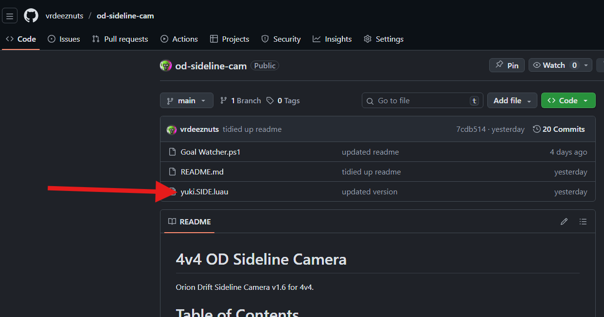
1. Click the download button
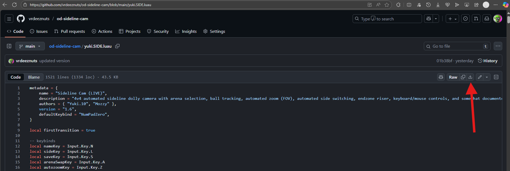

Done.

## Add a script to your spectator
1. After downloading the script, open a new File Explorer window (press `Win + E`)
1. Copy the text below (this is where your spectator scripts are)
    > %USERPROFILE%\Documents\Another-Axiom\A2\Cameras\Behaviors
1. Click the address bar in the File Explorer (or click the window then press `Ctrl + L`)
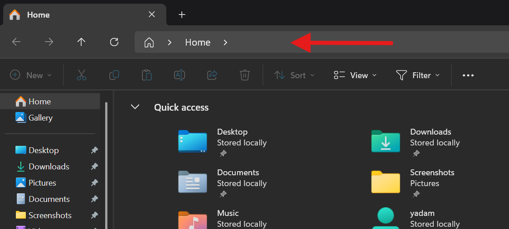
1. Paste the text you copied then press `Enter`
1. Drag and drop the script from your `Downloads` folder into your `Behaviors` folder
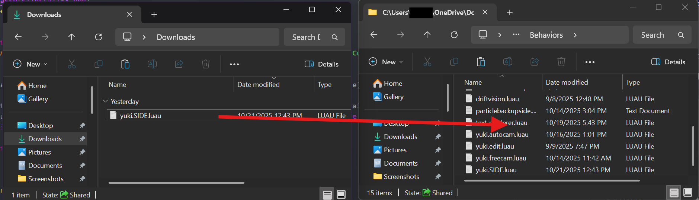
1. Now when you open up the spectator, you should see `yuki.side` as one of the camera options.
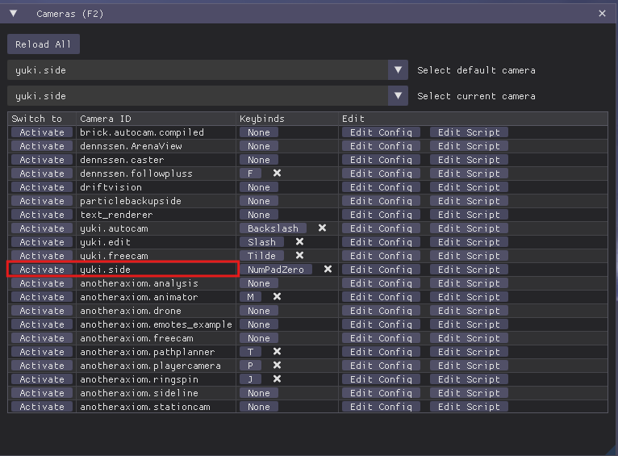

Done.

# Usage & Customization
**DON'T FORGET TO SAVE YOUR SETTINGS AFTER YOU SET THINGS UP** (press the `s` key or click the `Save Current Settings` button).

## Using the camera
`Numpad 0` key: default keybind to select the camera when you open spec (you can change it if you like). 

Since this is an auto-cam, you don't need to do anything while actively running it. With that being said, you still currently have to select the arena you want to spectate if the default or saved arena is not the right one. *In a future version, I'll add an auto-select arena based on a whitelist.*

### Base Workflow After Setup
1. Open Spectator
1. Select server
1. Press `Numpad 0` key or activate `yuki.side` for this camera if not set as default
1. Navigate to desired arena you want the camera to be at (`a` key, `up/down` arrow keys) (see [Arena Navigation](#arena-navigation) below)
1. (Optional) Confirm settings are good (these are good, default settings recommended)
    1. **Click the `s` key or the Save Current Settings button if you make any changes!**
1. (Optional) Confirm Medal clipping whitelist is good if using auto-clipping (this whitelist is also used if you're using other triggers)
1. (Optional) Start `OD Trigger Watcher.ps1` Powershell script (see [run script instructions](#run-the-script-for-the-first-time))
1. (Optional) Open OBS (if using the in-game recording gestures, make sure this window is the active window before hopping on the game)
1. Win scrim!

### Arena Navigation
- `up` and `down` arrow keys: cycle between the arenas on the side you're on (e.g., if you're at West-1 and you click `down`, it'll move to West-3)
- `a`: jump between East and West Driftplexes
- `l`: swap sideline (if you have `Auto-switch Sideline` enabled, this is kind of useless tbh)

### Other Keyboard/Mouse Functions
#### Keyboard
- `s`: Save current settings
- `n`: Toggle nametags
- `z`: Toggle auto zoom
- `e`: Toggle endzone rise
- `c`: Toggle endzone inward hook

#### Mouse
- `Mouse scrolling`: zoom in or out 
    Details:
    - [x] Auto Zoom: it will try to keep the ball roughly the same size based on how much you've zoomed in
    - [ ] Auto Zoom (disabled): normal zoom in/out without auto-adjusting

## Settings
There are a ton of settings that you can use or configure to your preferences. There is also decent documentation and tooltips in the GUI to provide guidance on what each setting is. 

Default/Best Settings:
- Arena
    - [x] Auto-switch Sideline
    - [x] Instant side switch
- Camera
    - Toggles
        - [x] Ball Outline when Hidden
        - [x] Auto Zoom
        - [ ] Endzone Rise (off)
        - [x] Endzone Inward Hook
    - Sliders
        - How much the camera moves inward: `2.5`
        - How much the camera moves backward: `0`
        - Sideline distance (x) from arena center: `2093`
        - Dolly rail length (y) from half field: `3072`
        - Ball tracking smoothing: `0.3 - 0.35`
        - Dolly smoothing: `0.2 - 0.3`
- Ball Trail
    - Trail length: `0.1 - 0.2`
    - Max Thickness: `25 - 26`
    - Ball Trail Start Offset: `1 - 3`

# What's Included
- `yuki.SIDE.luau` - this is the camera script that you would put with other camera scripts. It has 99% of the functionality but doesn't include the auto-clipping (the spectator API is sandboxed, so it can't send keystrokes by itself).
- `OD Trigger Watcher.ps1` - this is a Powershell script that enables the auto-clipping feature. It listens for certain messages in the A2.log (which is auto-generated each time you run spec) to trigger your clipping hotkey.

# Setup
You can choose from either setup instructions below.  
*If you choose [Option 2](#option-2-setup-with-auto-clipping), you only need to do this setup once. Any subsequent run should be pretty seamless.*
- If you're not interested in the auto-clipping feature, choose [Option 1](#option-1-easy-setup-no-auto-clipping). 
- If you want auto-clipping, choose [Option 2](#option-2-setup-with-auto-clipping).

## Option 1: Easy Setup, No Auto-Clipping
1. Download the `yuki.SIDE.luau` file and put it in your `...\Documents\Another-Axiom\A2\Cameras\Behaviors\` folder (same has how you'd normally do it with any other camera script).
1. Done.

## Option 2: Setup With Auto-Clipping (No chapter markers or recording gestures)
1. Download `yuki.SIDE.luau` and put it in your `...\Documents\Another-Axiom\A2\Cameras\Behaviors\` folder (same has how you'd normally do it with any other camera script).
1. Download `OD Trigger Watcher.ps1`. Put it in a safe folder (I recommend making a new folder and putting it on your desktop).
1. If you've never used Powershell scripting before:
    1. Click the Windows key -> Type `powershell` -> Click `Run as Administrator` -> Click `Yes` in the admin pop-up.
    1. In the Powershell window that pops up, type `Set-ExecutionPolicy RemoteSigned -Scope CurrentUser` -> press `Enter` -> Type `a`, `Enter` if prompted (this allows you to run Powershell scripts, which is used to send the clipping hotkey when goals are scored), and finally close the Powershell terminal.  
    1. Go back to the File Explorer where the `OD Trigger Watcher.ps1` file is located and Right click on the file -> Click Properties.
    1. In the Properties window, Click the `Unblock` checkbox then hit `Apply`. Click `OK` to close the window.
1. Done.

### Auto-Clipping Notice
Because the camera scripts are sandboxed (aka no way to interact with your computer outside of the game), I had to write that Powershell script to be able to send keystrokes. It works by listening to the auto-generated A2.log file (usually found at `%LOCALAPPDATA%\A2\Saved\Logs\A2.log`) for a specific string - `"GOAL_SCORED_MEDAL_TRIGGER"`. When the script sees that string in the log, it will send your specified clipping hotkey after an optional delay. Refer to the [auto-clipping instructions](#option-2-setup-with-auto-clipping) below to set it up.

## Option 2.1: OBS Chapter Markers and Triggers
Chapter markers are the timestamps you would put in the description of a YouTube video to mark different sections of the video (e.g., Intro, Ad, Gameplay, etc.). The markers added to the script will provide timestamps of the rounds' start/end, as well as goals (if you've enabled the whitelist, only goals scored by your whitelisted players will be logged).

Triggers are simply just the string being printed to the log (e.g., `"GOAL_SCORED_MEDAL_TRIGGER"`, `"ROUND_START_TRIGGER"`, etc.) that the Powershell script watches the A2.log for, which triggers hotkeys. It currently watches for round start, round end, and goals scored. To get this set up, follow the instructions below.

1. Download, extract, and run the OBS Chapter Marker Manager Installer - https://obsproject.com/forum/threads/streamup-chapter-marker-manager.176239/. 
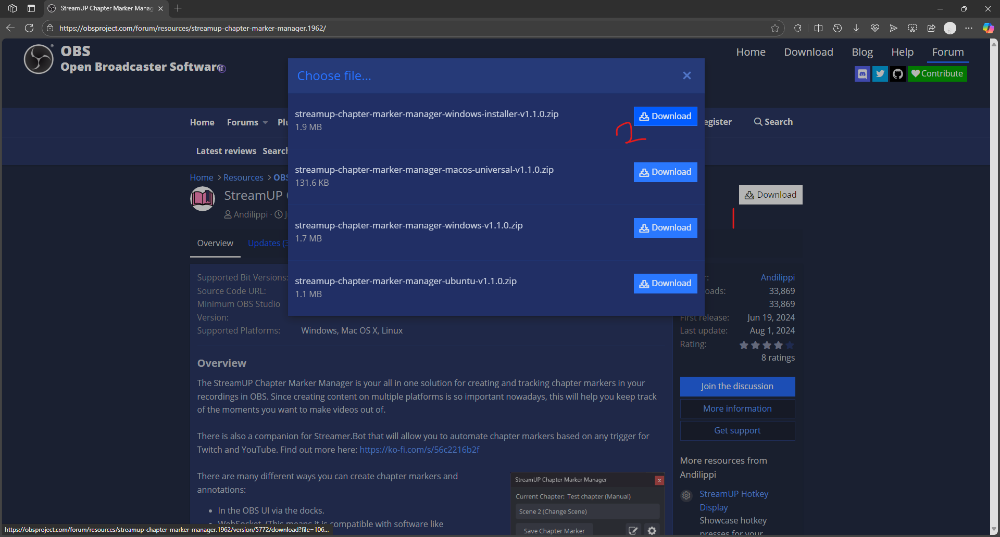
1. Open OBS and add the `StreamUP Chapter Marker Manager` dock for easier setup.
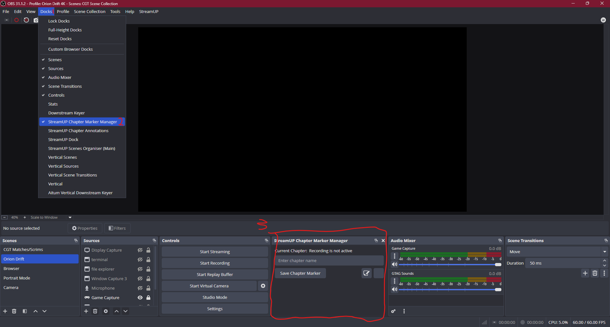
1. Add the chapter markers for "Goal Marker", "Round Start Marker", and "Round End Marker" (start by clicking the empty button on the Chapter Marker Manager dock).
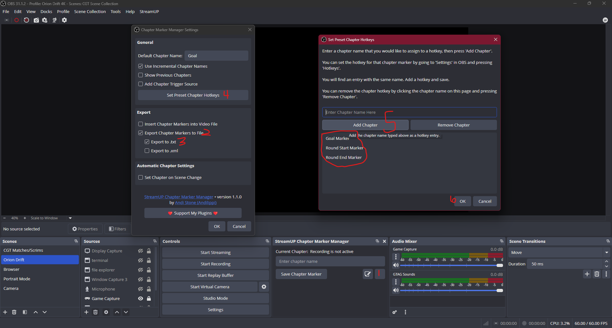
1. Open Settings, go to Hotkeys.
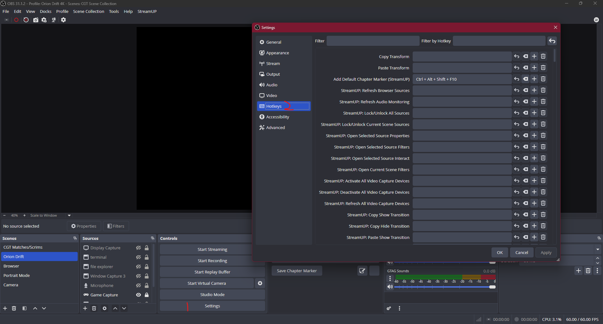
1. In the Filter textbox, type `marker`. Add hotkeys for "Goal Marker", "Round Start Marker", and "Round End Marker" (use what I use IF you have the numpad on your keyboard; change if those hotkeys are already used or you don't have the numpad). Click Apply.
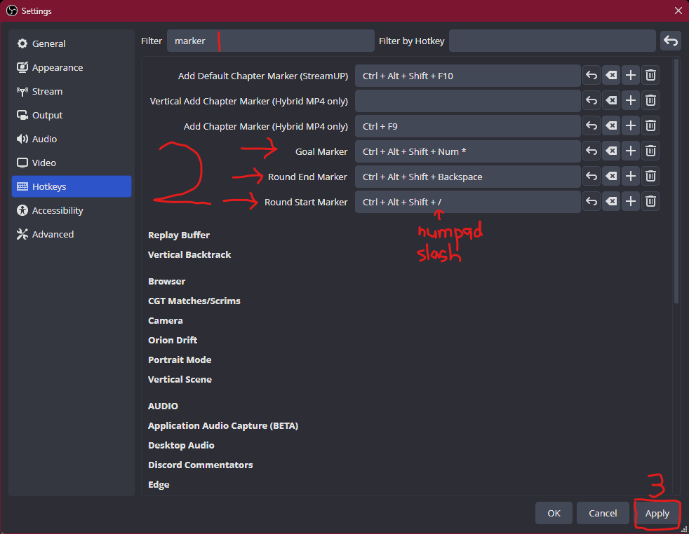
1. Now type `record` in the search box. Add hotkeys for "Start Recording" and "Stop Recording". Click Apply, then click OK to close.
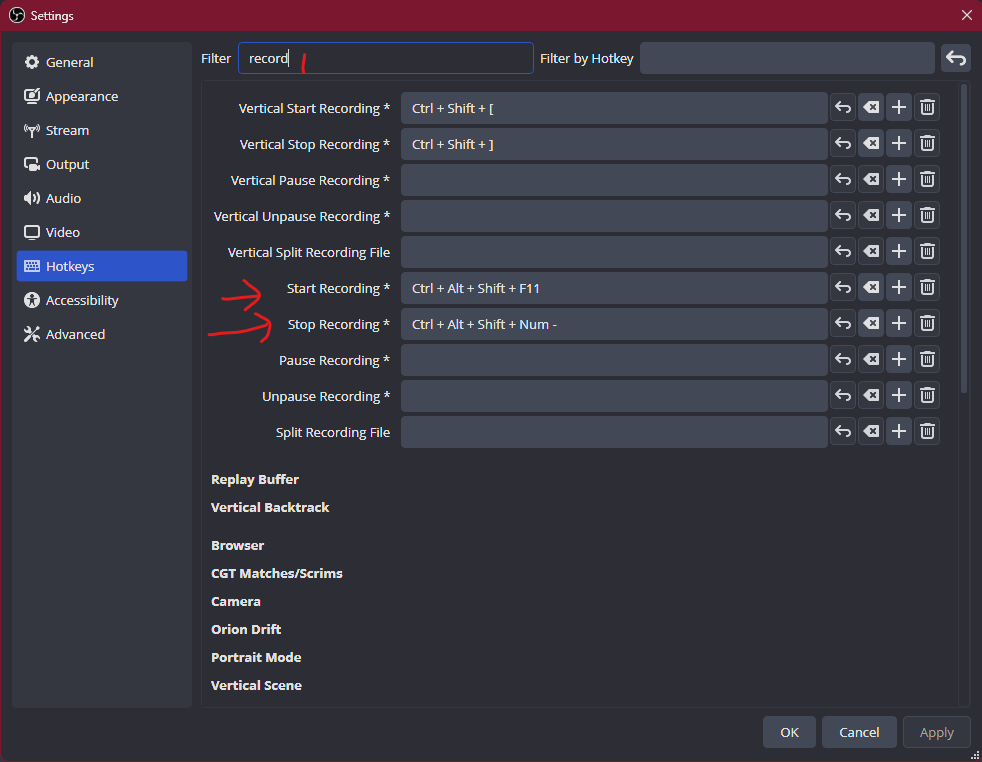

OBS is now set up to read hotkeys. If you used the hotkeys I've provided, then when you run the `OD Trigger Watcher.ps1` for the first time, you can use the default hotkeys (press Enter when it prompts for each one).

### How to start/stop recordings from in game
Known Gotcha: 
Because OD will capture all global hotkeys, these OBS hotkeys will not work properly unless OBS is the active window. In other words, just click the OBS window last (so it's on top) before hopping on to play.

> If you want it to work even when OBS is not the active window:
>> 1. Right click OBS on the taskbar
>> 1. Click Properties
>> 1. Click Compatibility
>> 1. Check Run this program as an administrator
>> 1. Click Apply
>> 1. Restart OBS

To start recordings while in the game:
1. Hold both hands in the air (aka not touching anything)
1. Hold down both triggers (index fingers) for 2 seconds. 
**Make sure your thumbs and middle fingers are not touching the controllers.**
1. If you did it right, the camera should jump in front of your face for 2 seconds letting you know it worked.

To stop recording, do the same gesture.

#### Recommendation
Don't record on OBS and clip with Medal. If you're recording with OBS, close Medal. If you're clipping with Medal, close OBS. 

I haven't fully tested everything out properly with both, and my Medal is kind of finnicky to begin with, so I rarely use it.

#### OBS Triggers → Default Hotkeys
- Goal OBS trigger → `Ctrl + Alt + Shift + Num *`
- Round Start OBS trigger → `Ctrl + Alt + Shift + Num /`
- Round End OBS trigger → `Ctrl + Alt + Shift + Backspace`
- Start Recording OBS trigger → `Ctrl + Alt + Shift + F11`
- Stop Recording OBS trigger → `Ctrl + Alt + Shift + Num -`

## Run the script for the first time
The script will generate a file called config.json after you've run it once. This file saves the hotkeys you've set for all of the different triggers (e.g., Medal, markers, start/stop recording). That's why I recommend making a folder on your desktop and putting the `OD Trigger Watcher.ps1` script in there - so you don't lose anything.
1. Single click the script so it's selected, then right click it.
1. Click Run with Powershell.
1. If you've followed [Option 2](#option-2-setup-with-auto-clipping-no-chapter-markers-or-recording-gestures) instructions, you only need to make sure that the Medal clipping hotkey is the right one. You can press Enter on the rest to skip them.
1. If you've followed [Option 2.1](#option-21-obs-chapter-markers-and-triggers), then make sure these hotkeys match the ones you set up in OBS. If you used the [default hotkeys](#obs-triggers--default-hotkeys), then you can just press Enter for all of them.

With the script running, now it will watch for any triggers you set up.

### Hotkey Info
The following is the actual text you'd type if you plan to change any hotkeys (for a full list, check [Microsoft System Windows Forms](https://learn.microsoft.com/en-us/dotnet/api/system.windows.forms.sendkeys?view=windowsdesktop-10.0)). You would combine these symbols to form the hotkey (e.g., Ctrl + Shift + Alt + PageDown → `^%+{PGDN}`)
- Ctrl: `^` (example: `^c` for `Ctrl + C`)
- Alt: `%` (example: `%{F4}` for `Alt + F4`)
- Shift: `+` (example: `+a` for `Shift + a`)
- Enter: `~`
- Tab: `{TAB}`
- Esc: `{ESC}`
- Delete: `{DEL}`
- Home: `{HOME}`
- End: `{End}`
- Full Example (`Ctrl + Alt + Shift + F11`): `^%+{F11}`
- Full Example (`Ctrl + Alt + Shift + Num /`): `^%+{DIVIDE}`
- Full Example (`Ctrl + Alt + Shift + /`): `^%+/`
- Full Example (`Ctrl + Alt + Shift + 8`): `^%+8`

# Future Work
Things I plan to add or want to add to this camera.
- [ ] Add auto-select arena based on whitelist
- [ ] Add more info to scoreboard GUI
    - [x] Assists
    - [x] Pass Attempts
    - [x] Completed Passes
    - [x] Turnovers
    - [x] Steals (still tweaking)
    - [x] Interceptions
    - [ ] Saves
- [x] update keybinds
    - [x] save (replace swap sideline button with different key)
- [ ] I'm open to requests and/or feedback

# Credits
- scripts written by `Yuki.10`
- some components inspired by `Dennssen` and `Brick.Rage`
- script idea by `Mozzy`
- auto-clipping requested by `Dwagin`